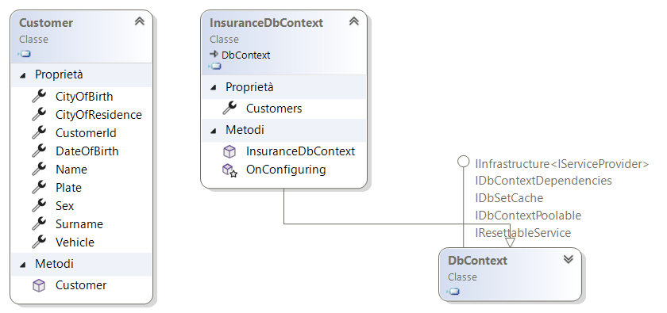
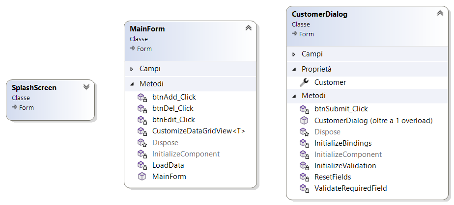

# Orfelo Assicurazioni
Orfelo Assicurazioni è un'applicazione per la gestione dei clienti e delle polizze assicurative. 

## Panoramica del progetto
Orfelo Assicurazioni è un sistema software sviluppato per gestire i clienti e le polizze di un'azienda assicurativa. 
L'applicazione consente agli utenti di registrare i dettagli dei clienti, visualizzare le loro polizze e gestire le operazioni di aggiunta, modifica ed eliminazione dei dati.

## Architettura del Progetto
Il progetto Orfelo Assicurazioni è stato sviluppato utilizzando il linguaggio di programmazione C# e il framework .NET. 
La struttura del progetto è organizzata secondo le best practices di progettazione del software, con una suddivisione logica dei componenti in classi, moduli e layer.

### Struttura dei File
- **InsuranceCustomerManager.Console**: Contiene il codice per l'applicazione console in ambito test e le classi di dominio e la logica di business comune a entrambe le applicazioni.
- **InsuranceCustomerManager.Console.Migrations**: Contiene il codice (auto generato e non) riguardante le migrazioni del DB avvenute in ambito test.
- **InsuranceCustomerManager.GUI**: Contiene il codice per l'applicazione GUI di gestione dei clienti e delle polizze.

## Diagrammi UML
Di seguito sono riportati alcuni diagrammi UML che mostrano la struttura delle classi nel progetto:

### Classi del DB



### Classi della GUI



## Attributi Personalizzati

Nel progetto sono stati definiti alcuni attributi personalizzati per la gestione e visualizzazione dei dati nella GUI.

### `ColumnHeaderAttribute`
Questo attributo viene utilizzato per specificare l'intestazione della colonna per una proprietà.

**Esempio di utilizzo**:
```csharp
[ColumnHeader("Nome")]
public string Name { get; set; }
```

### `ColumnVisibilityAttribute`
Questo attributo viene utilizzato per specificare la visibilità della colonna per una proprietà.

**Esempio di utilizzo**:
```csharp
[ColumnVisibility(true)]
public bool IsVisible { get; set; }
```

### `ColumnFormatAttribute`
Questo attributo viene utilizzato per specificare il formato della colonna per una proprietà.

**Esempio di utilizzo**:
```csharp
[ColumnFormat("dd/MM/yyyy")]
public DateTime DateOfBirth { get; set; }
```

## Documentazione XML

Il progetto fa ampio uso della documentazione XML per fornire informazioni dettagliate sulle classi, i metodi e gli attributi all'interno del codice. 
Questa documentazione è integrata direttamente nell'IDE Visual Studio, 
consentendo agli sviluppatori di visualizzare facilmente le descrizioni e i dettagli delle varie componenti del codice mentre scrivono e leggono il codice sorgente.

Oltre alla documentazione XML, sono presenti anche commenti regolari nel codice per fornire ulteriori spiegazioni e contestualizzazioni. 
Questo approccio combinato garantisce una migliore comprensione del codice e facilita il processo di sviluppo e manutenzione del progetto.


## Suddivisione del Lavoro
- **Sviluppo del Codice**: Loris Accordino
- **Gestione del Database**: Francesco Accolla
- **Grafica dell'Applicazione**: Jessica Noce
- **Curatore del Repository**: Simone Carnevale e Federico Foglieni

## Ricerca generale
Durante lo sviluppo di Orfelo Assicurazioni, ci siamo impegnati in una ricerca dettagliata per garantire un'esperienza utente completa e personalizzata. 

Abbiamo raccolto informazioni chiave sui clienti e sulle loro polizze assicurative, concentrandoci su una vasta gamma di dettagli per arricchire l'esperienza complessiva dell'utente.

## Aspetti grafici
Per la grafica dell'applicazione, abbiamo adottato uno stile moderno e professionale, ispirato alle migliori pratiche del settore. 

Abbiamo selezionato attentamente colori e tipografie per creare un'interfaccia utente intuitiva e piacevole. 
Il design moderno contribuisce a conferire all'applicazione un aspetto professionale e contemporaneo, migliorando l'esperienza visiva degli utenti.

## Installazione

Per installare ed eseguire l'applicazione, segui questi passaggi:
1. Clona il repository sul tuo computer.
2. Apri la soluzione in Visual Studio.
3. Compila e avvia l'applicazione.

## Dipendenze
Orfelo Assicurazioni dipende dalle seguenti tecnologie e librerie:

- Microsoft.EntityFrameworkCore
- System.ComponentModel (spazio dei nomi incluso in .NET)
- System.Windows.Forms (spazio dei nomi incluso in .NET)

Assicurarsi di avere tutte le dipendenze installate correttamente prima di eseguire l'applicazione.

## Issues e Bug
Per segnalare problemi o bug nell'applicazione, si prega di aprire una nuova issue nel repository su GitHub. 
Assicurarsi di includere una descrizione dettagliata del problema riscontrato e, se possibile, fornire passaggi per riprodurlo.

## Contribuire
Siamo grati a tutti coloro che contribuiscono a migliorare Orfelo Assicurazioni. 

Se desideri contribuire a questo progetto, segui questi passaggi:
1. Fai una fork del repository.
2. Crea un branch per il tuo lavoro (`git checkout -b feature/nome-feature`).
3. Esegui i tuoi cambiamenti e commit (`git commit -am 'Aggiungi una nuova feature'`).
4. Pusha il branch sul tuo repository forkato (`git push origin feature/nome-feature`).
5. Apri una pull request nel repository originale.

Consulta il file [CONTRIBUTING.md](CONTRIBUTING.md) per ulteriori informazioni su come partecipare.

## Release e Tags
Assicurarsi di controllare le release e i tag nel repository per le versioni stabili e le funzionalità aggiuntive. 
Ogni release è accompagnata da note sulle modifiche che descrivono le nuove funzionalità, le correzioni di bug e altre modifiche apportate al codice.

## Supporto
Se si hanno domande o dubbi sull'utilizzo di Orfelo Assicurazioni, non esitare a contattare il team di sviluppo tramite il sistema di issue di GitHub o inviando un'email a support@orfelo.com. 
Siamo qui per aiutarti!

## Contribuitori
- Loris Accordino
- Francesco Accolla
- Jessica Noce
- Simone Carnevale
- Federico Foglieni

## Ringraziamenti
Ringraziamo tutti coloro che hanno contribuito a rendere possibile questo progetto, inclusi i contributori, gli utenti beta e la community open source. 
Il vostro supporto è molto apprezzato!

## Roadmap
Per ulteriori informazioni sulle prossime funzionalità e miglioramenti pianificati per Orfelo Assicurazioni, consulta il file [ROADMAP.md](ROADMAP.md) nel repository.

## Changelog
Consulta il file [CHANGELOG.md](CHANGELOG.md) nel repository per un registro completo delle modifiche apportate a ogni versione di Orfelo Assicurazioni.

---

*Orfelo Assicurazioni è un progetto open source sviluppato da un team di appassionati di software. 
Contribuisci anche tu al nostro progetto e rendilo ancora migliore!*